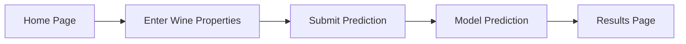
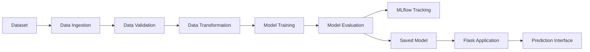
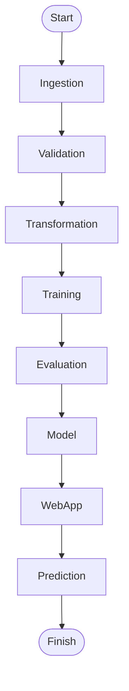
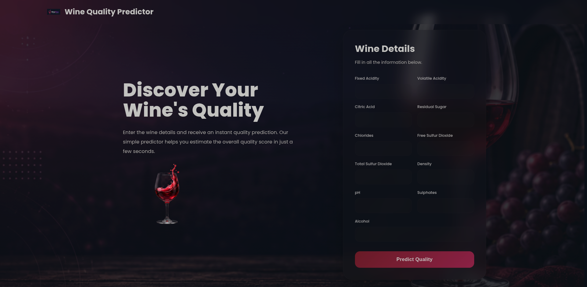
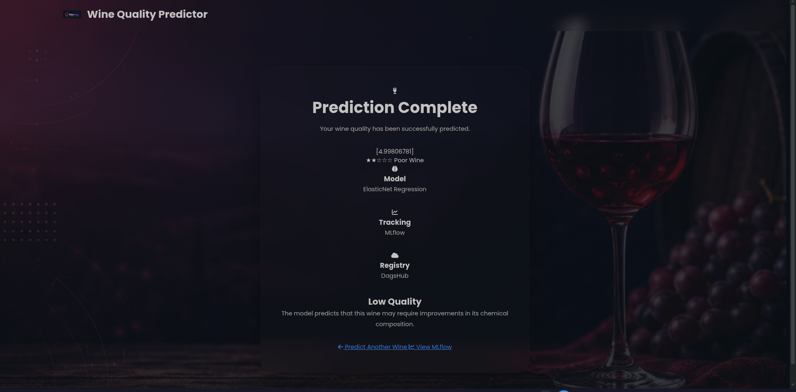
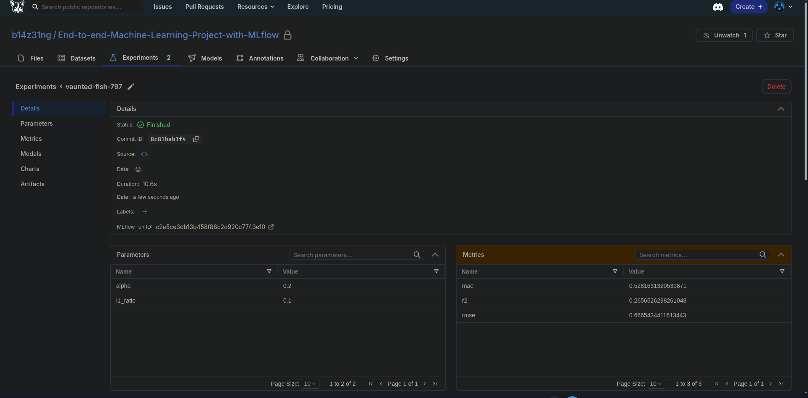
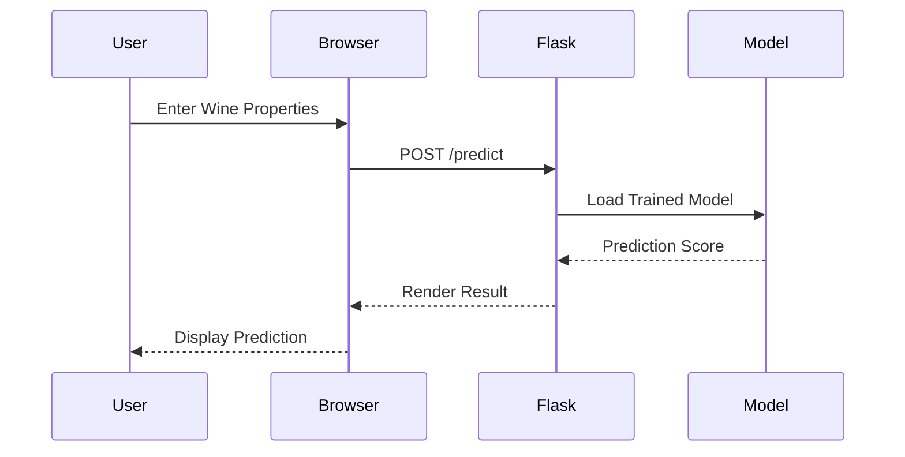
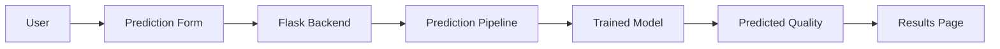
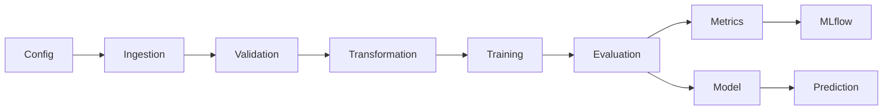
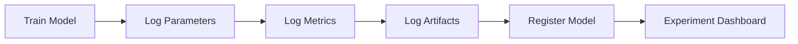

<div align="center">

# 🍷 Wine Quality Predictor

### A Complete End-to-End Machine Learning Application for Wine Quality Prediction

<p align="center">

A production-ready machine learning project demonstrating the complete lifecycle of a predictive model, from data ingestion and validation to model training, experiment tracking, and web-based inference.

</p>

---


</div>

---

# 📖 Overview

Wine Quality Predictor is a complete machine learning application that predicts the quality score of red wine using its physicochemical properties.

The project demonstrates an end-to-end workflow including:

- Data ingestion
- Data validation
- Data transformation
- Model training
- Experiment tracking
- Model evaluation
- Web application deployment

A modern responsive web interface allows users to enter wine characteristics and instantly receive a predicted quality score.

---
# 🎨 User Interface

The application features a redesigned, modern web interface focused on simplicity, responsiveness, and ease of use. The goal is to provide a seamless experience where users can enter wine characteristics and receive predictions in just a few clicks.

### Highlights

- Modern glassmorphism-inspired interface
- Responsive layout for desktop, tablet, and mobile devices
- Clean and intuitive prediction form
- Interactive buttons with loading indicators
- Beautiful results page with quality score visualization
- Smooth animations and transitions
- Consistent color palette and typography
- Optimized user experience with minimal navigation

---

### Interface Overview



---

# ✨ Features

### Machine Learning Pipeline

- Automated data ingestion
- Schema-based data validation
- Dataset transformation
- Model training
- Model serialization
- Performance evaluation

---

### Experiment Tracking

- Parameter logging
- Metric logging
- Artifact logging
- Model version tracking
- Remote MLflow integration using DagsHub

---

### Web Application

- Modern responsive interface
- Interactive prediction form
- Beautiful result page
- Glassmorphism UI
- Mobile friendly design

---

### Project Highlights

- End-to-End ML workflow
- Modular project architecture
- Docker support
- Flask backend
- MLflow experiment tracking
- Ready for deployment

---

# 📂 Project Structure

```text
Wine-Quality-Predictor
│
├── app.py
├── main.py
├── config/
├── artifacts/
│
├── research/
│
├── src/
│   └── mlProject/
│       ├── components/
│       ├── config/
│       ├── constants/
│       ├── entity/
│       ├── pipeline/
│       └── utils/
│
├── templates/
│   ├── base.html
│   ├── index.html
│   └── results.html
│
├── static/
│   ├── css/
│   ├── js/
│   └── assets/
│
├── Dockerfile
├── requirements.txt
├── params.yaml
├── schema.yaml
└── README.md
```

---

# 🏗 System Architecture



---

# 🔄 Machine Learning Workflow



---

# 📸 Application Preview

<p align="center">



</p>

---

<p align="center">



</p>

---

<p align="center">



</p>
# 🚀 Getting Started

## Prerequisites

Before running the project, ensure the following are installed on your system.

- Python 3.11+
- Git
- pip
- Docker *(Optional)*

---

# 📥 Clone the Repository

```bash
git clone https://github.com/b14z31ng/wine_predictor

cd wine_predictor
```

---

# 🐍 Create a Virtual Environment

### Linux / macOS

```bash
python -m venv .venv

source .venv/bin/activate
```

or if you already have an existing environment

```bash
source /home/<username>/envs/cuda/bin/activate
```

### Windows

```powershell
python -m venv .venv

.venv\Scripts\activate
```

---

# 📦 Install Dependencies

```bash
pip install -r requirements.txt
```

---

# 🔑 Configure MLflow

Create a `.env` file in the project root.

```env
MLFLOW_TRACKING_URI=YOUR_DAGSHUB_MLFLOW_URI

MLFLOW_TRACKING_USERNAME=YOUR_DAGSHUB_USERNAME

MLFLOW_TRACKING_PASSWORD=YOUR_DAGSHUB_TOKEN
```

Example

```env
MLFLOW_TRACKING_URI=https://dagshub.com/<username>/<repository>.mlflow

MLFLOW_TRACKING_USERNAME=<username>

MLFLOW_TRACKING_PASSWORD=<token>
```

---

# 🏋️ Train the Model

Run the complete machine learning pipeline.

```bash
python main.py
```

Pipeline stages

- Data Ingestion
- Data Validation
- Data Transformation
- Model Training
- Model Evaluation
- MLflow Logging

Artifacts generated after training

```text
artifacts/

├── data_ingestion/
│   ├── data.zip
│   └── winequality-red.csv
│
├── data_transformation/
│   ├── train.csv
│   └── test.csv
│
├── data_validation/
│   └── status.txt
│
├── model_trainer/
│   └── model.joblib
│
└── model_evaluation/
    └── metrics.json
```

---

# 🌐 Run the Web Application

```bash
python app.py
```

Open your browser

```
http://127.0.0.1:8080
```

---

# 🎨 User Interface

The application includes a redesigned modern interface focused on usability.

### Home Page

- Responsive layout
- Clean glassmorphism design
- Interactive prediction form
- Background illustration
- Mobile friendly

### Prediction Page

- Displays predicted wine quality
- Clean result presentation
- Easy navigation back to prediction page

---

# 🔄 Prediction Workflow



---

# 🧩 Application Workflow



---

# 🐳 Docker

Build the Docker image

```bash
docker build -t wine-quality-predictor .
```

Run the container

```bash
docker run -p 8080:8080 wine-quality-predictor
```

Then open

```
http://localhost:8080
```

---

# 📁 Configuration Files

The project configuration is managed through YAML files.

| File | Purpose |
|------|----------|
| `config.yaml` | Pipeline configuration |
| `params.yaml` | Model hyperparameters |
| `schema.yaml` | Dataset schema |

---

# ⚙️ Training Pipeline



---
# 📊 Experiment Tracking

The project uses **MLflow** with **DagsHub** as the remote tracking server to record every experiment.

Each training run automatically logs:

- Hyperparameters
- Evaluation metrics
- Trained model
- Model signature
- Input example
- Artifacts

This makes experiments reproducible and simplifies model comparison.

---

# 📈 Latest Experiment

## Parameters

| Parameter | Value |
|-----------|-------|
| Alpha | **0.2** |
| L1 Ratio | **0.1** |

---

## Evaluation Metrics

| Metric | Value |
|---------|-------:|
| RMSE | **0.6665** |
| MAE | **0.5282** |
| R² Score | **0.2657** |

---

## MLflow Workflow



---

# 📂 Logged Artifacts

After every successful training run, the following artifacts are generated.

```text
artifacts/

├── data_ingestion/
│
├── data_validation/
│
├── data_transformation/
│
├── model_trainer/
│   └── model.joblib
│
└── model_evaluation/
    └── metrics.json
```

---

# 🧠 Model Information

| Property | Value |
|----------|-------|
| Algorithm | ElasticNet Regression |
| Framework | Scikit-Learn |
| Model Format | Joblib |
| Prediction Type | Regression |
| Features | 11 |
| Dataset | Wine Quality (Red Wine) |

---

# 🍷 Input Features

The prediction model uses the following physicochemical properties.

| Feature |
|----------|
| Fixed Acidity |
| Volatile Acidity |
| Citric Acid |
| Residual Sugar |
| Chlorides |
| Free Sulfur Dioxide |
| Total Sulfur Dioxide |
| Density |
| pH |
| Sulphates |
| Alcohol |

---

# 🏛 Technology Stack

| Category | Technologies |
|-----------|--------------|
| Programming Language | Python |
| Backend | Flask |
| Machine Learning | Scikit-Learn |
| Experiment Tracking | MLflow |
| Remote Tracking | DagsHub |
| Configuration | YAML |
| Data Processing | Pandas, NumPy |
| Model Serialization | Joblib |
| Frontend | HTML, CSS, JavaScript |
| Containerization | Docker |

---

# 🌐 REST API

## Home

```http
GET /
```

Returns the prediction interface.

---

## Train Model

```http
GET /train
```

Runs the complete machine learning pipeline.

---

## Predict Wine Quality

```http
POST /predict
```

### Request

Form Data

| Field | Type |
|-------|------|
| fixed_acidity | float |
| volatile_acidity | float |
| citric_acid | float |
| residual_sugar | float |
| chlorides | float |
| free_sulfur_dioxide | float |
| total_sulfur_dioxide | float |
| density | float |
| pH | float |
| sulphates | float |
| alcohol | float |

---

### Response

Returns the predicted wine quality score rendered on the results page.

---

# 📷 Screenshots

## Home Page

> Replace with your homepage screenshot.

```
assets/screenshots/home.png
```

---

## Prediction Result

> Replace with your prediction result screenshot.

```
assets/screenshots/result.png
```

---

## MLflow Dashboard

> Replace with your MLflow experiment screenshot.

```
assets/screenshots/mlflow.png
```

---

# 📌 Highlights

- End-to-End Machine Learning Pipeline
- Automated Model Training
- Experiment Tracking with MLflow
- Remote Logging using DagsHub
- Interactive Web Interface
- Docker Ready
- Modular Project Architecture
- Production-Oriented Project Structure

---
# 🚀 Future Improvements

The current implementation provides a complete end-to-end machine learning workflow. Future enhancements that can further improve the project include:

- Support for multiple regression algorithms
- Automated hyperparameter optimization
- Batch prediction support
- REST API using FastAPI
- Authentication and user management
- Model version comparison dashboard
- Continuous Integration / Continuous Deployment (CI/CD)
- Cloud deployment
- Real-time monitoring
- Automated model retraining pipeline

---

# 📦 Deployment Options

The project can be deployed using various platforms.

| Platform | Status |
|----------|---------|
| Local Machine | ✅ |
| Docker | ✅ |
| AWS EC2 | ✅ |
| Render | ✅ |
| Railway | ✅ |
| Azure | ✅ |
| Google Cloud | ✅ |

---

# 🎯 Key Capabilities

This project demonstrates practical implementation of several important machine learning engineering concepts.

- End-to-End Machine Learning Pipeline
- Data Validation
- Feature Engineering
- Model Training
- Model Evaluation
- Experiment Tracking
- Model Serialization
- Flask Web Development
- Docker Containerization
- Modular Software Architecture

---

# 📖 References

- Wine Quality Dataset
  https://archive.ics.uci.edu/ml/datasets/wine+quality

- Scikit-Learn Documentation
  https://scikit-learn.org/

- MLflow Documentation
  https://mlflow.org/

- DagsHub Documentation
  https://dagshub.com/docs/

- Flask Documentation
  https://flask.palletsprojects.com/

---

# 🤝 Contributing

Contributions are welcome.

If you would like to improve the project:

1. Fork the repository.
2. Create a new feature branch.
3. Commit your changes.
4. Push the branch.
5. Open a Pull Request.

Please ensure that new features maintain the existing project structure and coding standards.

---

# ⭐ Repository Support

If you found this project useful:

- ⭐ Star the repository
- 🍴 Fork the repository
- 🛠 Contribute improvements
- 📝 Report issues
- 💡 Suggest new features

Your support is greatly appreciated.

---

# 📄 License

This project is distributed under the **MIT License**.

See the `LICENSE` file for more details.

---

# 👨‍💻 Author

**Reshad Romim**

GitHub

https://github.com/b14z31ng

---

<div align="center">

## 🍷 Wine Quality Predictor

*A complete end-to-end machine learning project demonstrating the journey from raw data to an interactive prediction application.*

Built with Python, Flask, Scikit-Learn, MLflow, Docker, and modern web technologies.

⭐ If you find this repository helpful, consider giving it a star.

</div>